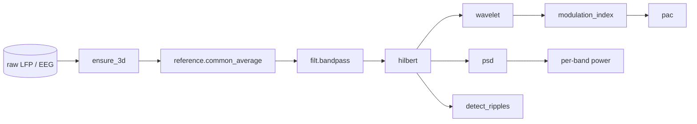
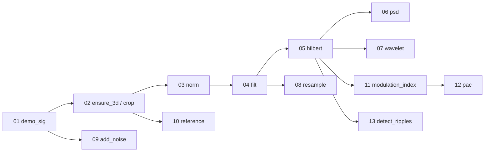

# scitex-dsp

<p align="center">
  <a href="https://scitex.ai">
    
  </a>
</p>

<p align="center"><b>Digital signal processing for scientific Python — PAC, Hilbert, wavelet, filters, resampling, demo signals.</b></p>

<p align="center">
  <a href="https://scitex-dsp.readthedocs.io/">Full Documentation</a> · <code>uv pip install scitex-dsp[all]</code>
</p>

<!-- scitex-badges:start -->
<p align="center">
  <a href="https://pypi.org/project/scitex-dsp/"></a>
  <a href="https://pypi.org/project/scitex-dsp/"></a>
  <a href="https://github.com/ywatanabe1989/scitex-dsp/actions/workflows/test.yml"></a>
  <a href="https://codecov.io/gh/ywatanabe1989/scitex-dsp"></a>
  <a href="https://scitex-dsp.readthedocs.io/en/latest/"></a>
  <a href="https://www.gnu.org/licenses/agpl-3.0"></a>
</p>
<!-- scitex-badges:end -->

---

## Problem and Solution

| # | Problem | Solution |
|---|---------|----------|
| 1 | **Signal-processing pipelines mix NumPy, SciPy, MNE, and PyTorch with incompatible array shapes.** | **`scitex_dsp` exposes a uniform `(batch, channel, time)` 3-D contract via `ensure_3d` and the `@torch_fn` decorator.** |
| 2 | **Phase-Amplitude Coupling (PAC), wavelets, and ripple detection are scattered across one-off scripts.** | **First-class `pac`, `wavelet`, `hilbert`, `detect_ripples`, `modulation_index` reproducible primitives.** |
| 3 | **Demo signals for testing pipelines have to be re-rolled by every project.** | **`demo_sig(sig_type=...)` produces deterministic chirp / periodic / ripple test signals.** |

## Installation

```bash
pip install scitex-dsp
```

## Architecture

`scitex_dsp` is organised as flat building blocks plus four
sub-modules. Public entry points compose left-to-right into typical
neuroscience pipelines:



```
src/scitex_dsp/
├── _hilbert.py   _psd.py        _wavelet.py
├── _pac.py       _modulation_index.py
├── _detect_ripples.py
├── _resample.py  _crop.py       _ensure_3d.py
├── _demo_sig.py  _transform.py
├── filt.py       norm.py        reference.py
├── add_noise.py  params.py      example.py
└── utils/        # ensure_*, zero-pad, differential filters
```

All public functions accept `(channels, samples)` or
`(batch, channels, samples)`.

## 2 Interfaces

<details open>
<summary><strong>Python API</strong></summary>

<br>

```python
import scitex_dsp as dsp

xx, tt, fs = dsp.demo_sig(sig_type="chirp", fs=1024)
psd, ff = dsp.psd(xx, fs)
xf = dsp.filt.bandpass(xx, fs, bands=[[8, 12]])
hp = dsp.hilbert(xx)
pac, freqs_pha, freqs_amp = dsp.pac(xx, fs)
```

</details>

<details>
<summary><strong>Importable from the umbrella</strong></summary>

<br>

```python
import scitex
scitex.dsp.demo_sig(sig_type="chirp")  # `scitex.dsp` aliases `scitex_dsp`
```

</details>

## Demo

A 13-notebook progressive tutorial lives in [`examples/`](examples/),
committed with executed cell outputs — read on GitHub without running
anything locally.



See [`examples/README.md`](examples/README.md) for the full index
and suggested reading paths.

| # | Notebook | Topic | Cross-check |
|---|---|---|---|
| 01 | [`01_demo_sig.ipynb`](examples/01_demo_sig.ipynb) | synthetic test signals — uniform / gauss / periodic / chirp | — |
| 04 | [`04_filt.ipynb`](examples/04_filt.ipynb) | Butterworth bandpass / bandstop | — |
| 05 | [`05_hilbert.ipynb`](examples/05_hilbert.ipynb) | analytic signal — phase + envelope | `scipy.signal.hilbert` |
| 06 | [`06_psd.ipynb`](examples/06_psd.ipynb) | PSD + per-band integrated power | — |
| 07 | [`07_wavelet.ipynb`](examples/07_wavelet.ipynb) | continuous wavelet transform | — |
| 09 | [`09_add_noise.ipynb`](examples/09_add_noise.ipynb) | gauss / white / pink / brown — traces + PSDs | — |
| 12 | [`12_pac.ipynb`](examples/12_pac.ipynb) | phase-amplitude coupling heatmap | `tensorpac.Pac` |
| 13 | [`13_detect_ripples.ipynb`](examples/13_detect_ripples.ipynb) | end-to-end ripple detection — DataFrame + shaded events | — |

Re-run them all with `./examples/00_run_all.sh`.

## Part of SciTeX

`scitex-dsp` is part of [**SciTeX**](https://scitex.ai).

Install via the umbrella with `pip install scitex[dsp]`, then access as `scitex.dsp` or run `scitex dsp` from the CLI.

>Four Freedoms for Research
>
>0. The freedom to **run** your research anywhere — your machine, your terms.
>1. The freedom to **study** how every step works — from raw data to final manuscript.
>2. The freedom to **redistribute** your workflows, not just your papers.
>3. The freedom to **modify** any module and share improvements with the community.
>
>AGPL-3.0 — because we believe research infrastructure deserves the same freedoms as the software it runs on.

---

<p align="center">
  <a href="https://scitex.ai" target="_blank"></a>
</p>
